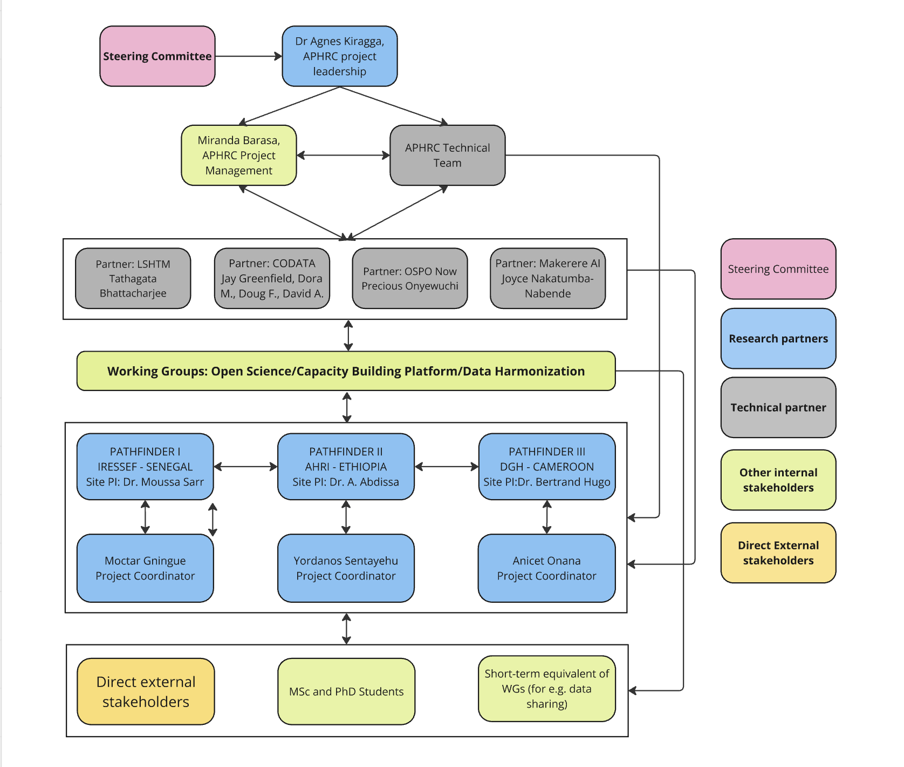

# DSWB Organogram and Team Structure

The DSWB project has been funded by the Wellcome Trust. Learn more about the project on our website: https://dswb.africa/.

*This organogram can be viewed and edited in this Miro board: https://miro.com/app/board/uXjVLgVaxak=/*

## Leadership

The project lead and principal investigator of DSWB is Dr. Agnes Kirraga from APHRC Kenya. You can learn about her and the APHRC team on our website: https://dswb.africa/dswb-secretariat/.

She reports to Steering Committee members, who are listed on our website: https://dswb.africa/steering-committee/.

## Pathfinder Institutions

You can learn about the Pathfinder Institutions on our website: https://dswb.africa/pathfinder-institutions/

Below are the primary representatives from these institutions:

- Douala General Hospital (DGH): Prof. Mbatchou Bertrand (PRINCIPAL INVESTIGATOR) and Dr. Anicet Onana (PROJECT COORDINATOR)
- Armauer Hansen Research Institute (AHRI): Dr. Alemseged Abdisa (PRINCIPAL INVESTIGATOR) and Yordanos Sentayehu (PROJECT COORDINATOR)
-  Institut de Recherche en Santé de Surveillance Epidémiologique et de Formations (IRESSEF): Dr. Moussa SARR (PRINCIPAL INVESTIGATOR) and Dr. Moctar Gningue (PROJECT COORDINATOR)

## Technical Partners

You can learn about the technical partners on our website: https://dswb.africa/collaborating-institutions/

Below are the primary representatives from these institutions:

- Africa CDC: Dr. Elvis Temfack
- CODATA: Jay Greenfield
- London School of Hygiene and Tropical Medicine: Tathagata Bhattacharjee
- Makerere AI: Joyce Nabende
- OSPO Now: Raphael Sonabend

_You can contact the listed members by email. Please request contact details from Miranda._
